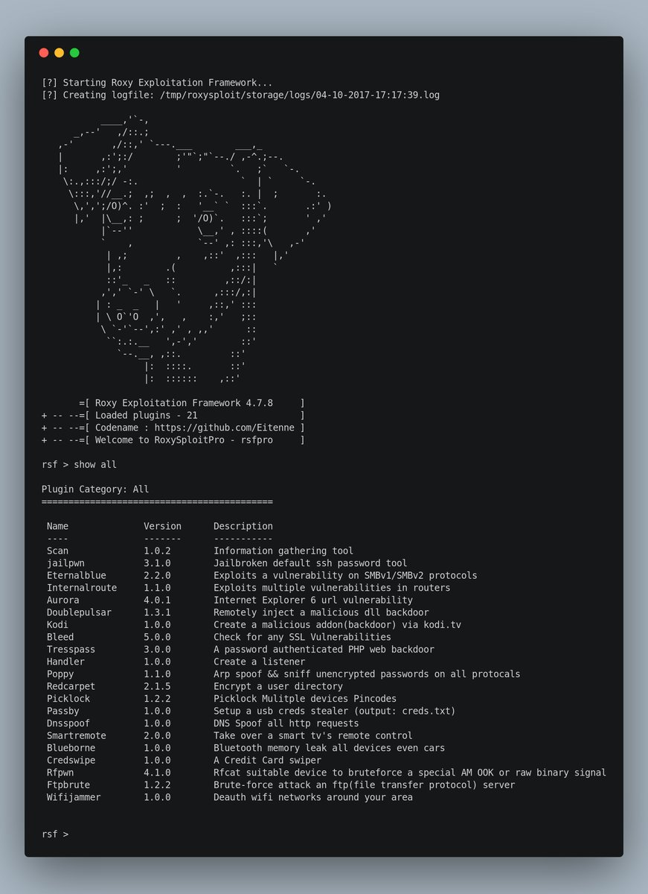

|Tested on|.
|---|---
|Arch Linux|Working
|Kali Linux|Working
|Ubuntu|Working
|Debian|Working
|Centos|Not Tested
|MacOSX|Needs porting
|Windows| Ha no.

## This is a release of the roxysploit pro version you can always support me at <a href="https://twitter.com/0x09f">@0x09f</a> or btc:  coming soon!
## How to install
<pre>$ git clone https://github.com/Eitenne/roxysploit.git; cd roxysploit; sudo /bin/bash install</pre>

## Legal Disclamer:
  The author does not hold any responsibility for the bad use of this tool,
  remember that attacking targets without prior consent is illegal and punished by law.

## Social:
## + <a href="https://discord.gg/8EP2sjv"> Discord</a>
## + <a href="https://www.youtube.com/channel/UCvydKPHB5fzqrJpS6BUqdRQ"> Youtube</a>
## + <a href="https://twitter.com/0x09f"> Twitter</a>

## Video Tutorials
[Hacking using Tresspass | RoxySploit / Roxy Exploitation Framework]: https://www.youtube.com/watch?v=47UMnkeM-hk
[Exploiting the browser | roxysploit]: https://www.youtube.com/watch?v=h6QO-rtIP_o

## Executing plugins examples
<pre>
rsf > use Picklock
rsf (plugins/picklock) > help

Core Commands
=============

  Command         Description
  -------         -----------
  help            show help menu
  execute         run the plugin
  exit            exit the current plugin

rsf (plugins/picklock) > execute
[?] OS :: Select the devices os

*0) Android :: Bruteforce 4digit pincode usb debugging
 1) Linux   :: Bruteforce Encrypted partions

[+] device: [0]:
</pre>
<pre>
rsf > use Poppy
rsf (plugins/poppy) > execute
[?] Interface :: Your interface
[+] interface: [wlan0]: wlp6s0
[?] Target :: Enter the targets ip
[+] target: [192.326.1.25]: 192.168.1.2
[?] Gateway :: Enter the gateway/router ip
[+] router: [192.168.1.1]:
[?] Function :: Would you like to setup dns spoofing?

*0) no :: Disable dns spoofing
 1) yes :: Enable dns spoofing

[+] function: [0]:
[?] Configuring Plugin

Name             Set Value
----             ----------
Interface        wlp6s0
Target           192.168.1.2
Router           192.168.1.1
Plugin           plugins/poppy

[?] Execute Plugins? [yes]:  
[*] Enabling IP Forwarding...
[*] Poisoning Targets...
</pre>

## What operating systems support roxysploit?
All Linux distros are currently supported, it is recomended for a prebuilt pentesting os like kali linux although.

## What is roxysploit?
roxysploit is a community-supported, open-source and penetration testing suite that supports attacks for numerous scenarios. conducting attacks in the field.

## Some containing Plugins in roxysploit
 
Scan is a automated Information gathering plugin it gives the user the ability to have a rest while the best Information gathering plugin can be executed.
 
Jailpwn is a useful plugin for any iphone device that has been jailbroken it will attempt to login to the ssh using its default password giving you a full shell.
 
Eternalblue is a recent plugin we added it Exploits a vulnerability on SMBv1/SMBv2 protocols these were collected from the nsa cyberweapons.
 
Internalroute Exploits multiple vulnerabilities in routers this can become very useful such as hotel wifi's.
 
Aurora this is a old plugin that can become very useful for pen-testers it exploits Internet Explorer 6 URL vulnerability.
 
Doublepulsar is giving you the ability to Remotely inject a malicious dll backdoor into a windows computer.
 
Kodi is a fantastic movie streaming platform but however it runs on linux we have Created a malicious addon(backdoor) via kodi.tv
 
Bleed uses a mass vulnerability check on finding any SSL Vulnerabilities.
 
Tresspass is a way of managing your php backdoor and gaining shell or even doing single commands it requires password authentication stopping any lurker.
 
Handler is commonly used to create a listener on a port.
 
Poppy is a mitm plugin allowing you to Arp spoof and sniff unencrypted passwords on all protocals such as ftp and http.
 
Redcarpet is a nice plugin keeping you safe from malicious hackers this will Encrypt a user directory.
 
Picklock is a local bruteforce plugin that you can Picklock/bruteforce Mulitple devices Pincodes such as android usb debugging.  
Passby can load a usb to steal all credentials from a windows computer in seconds.
 
Dnsspoof is common for man in the middle attacks, it can redirect any http requests to your dns.
 
Smartremote this is more of a funny remote exploit you can Take over a smart tv's remote control without authentication.
 
Blueborne is a recent Bluetooth memory leak all devices even cars.
 
Credswipe you have to have a card reader to clone them.
 
Rfpwn suitable device to bruteforce a special AM OOK or raw binary signal.
 
Ftpbrute Brute-force attack an ftp(file transfer protocol) server Wifijammer you can Deauth wifi networks around your area, meaning disconnecting all users connected to the network.
 

## Credits
0x5a
Aaronius
Witt
TDHU
Team(InsaneLand) @2017
